# AWS Linux Monitoring & Auto-Recovery System

## Description
This project implements a Linux-based monitoring and auto-recovery system deployed on an AWS EC2 Ubuntu instance. It monitors an Nginx service, validates HTTP response, writes logs, and automatically restarts the service when a failure is detected.

## Technologies
- AWS EC2
- Ubuntu Server
- Nginx
- Bash
- systemd
- cron
- CloudWatch

## Features
- Service status validation
- HTTP response check
- Automatic service restart
- Log generation
- Cron-based automation
- CloudWatch monitoring

## Project Structure
````
aws-linux-monitoring-project/
├── monitor_nginx.sh
├── README.md
└── logs/
    └── monitor.log
````

## Screenshots

### EC2 instance running
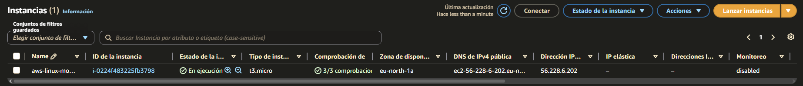

### Security Group rules
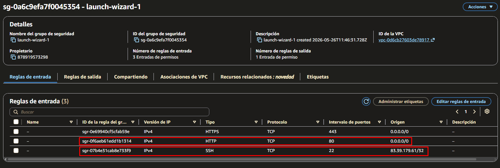

### SSH connection from Windows
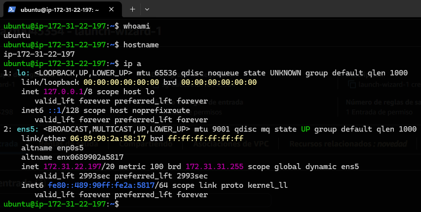

### Nginx service active
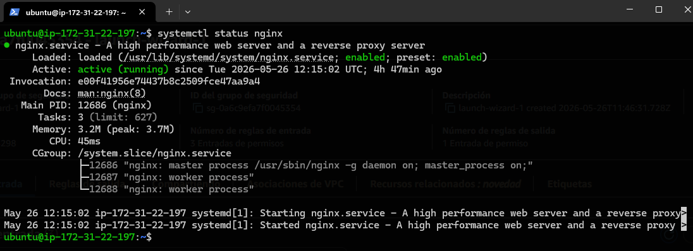

### Nginx running in browser
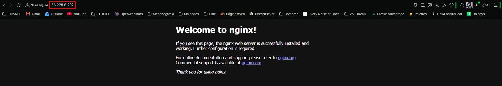

### Monitoring script
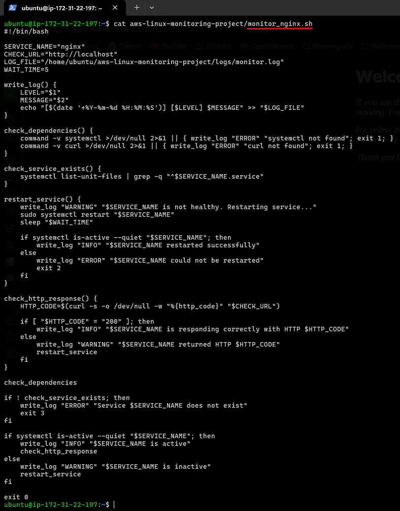

### Monitoring logs
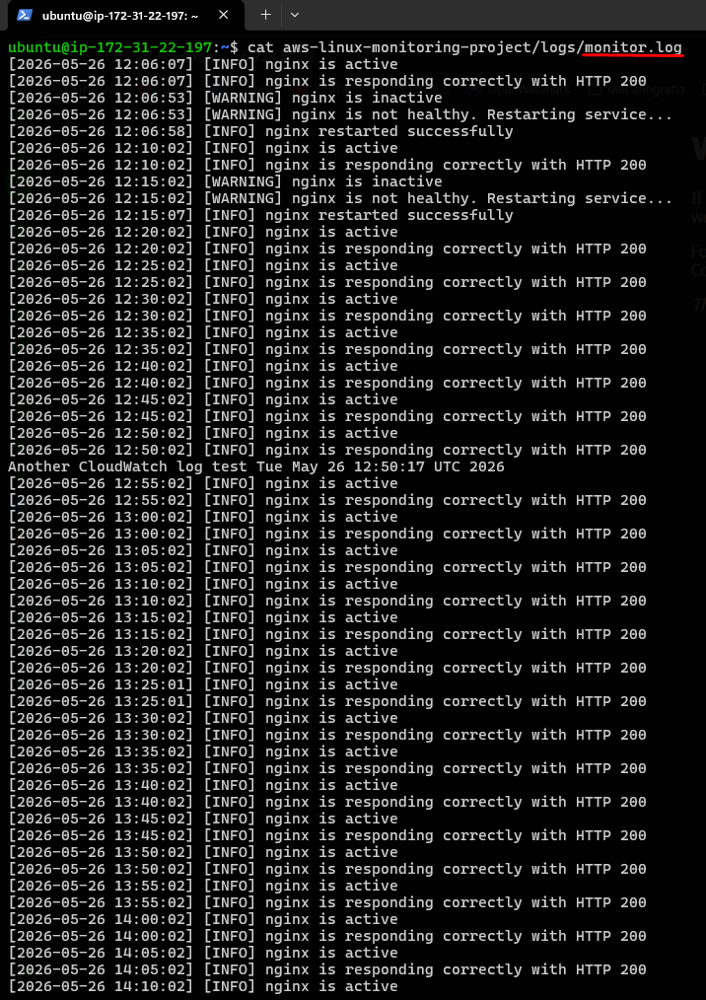

### Nginx stopped manually
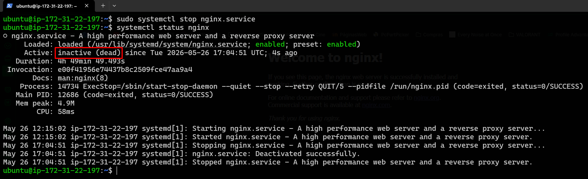

### Auto-recovery test
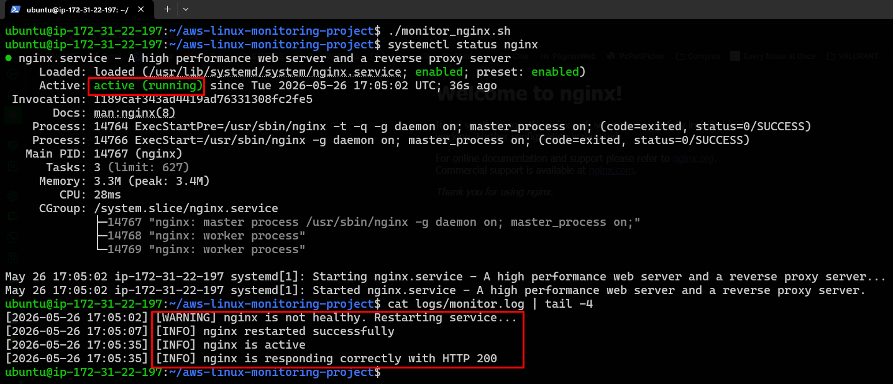

### Cron automation
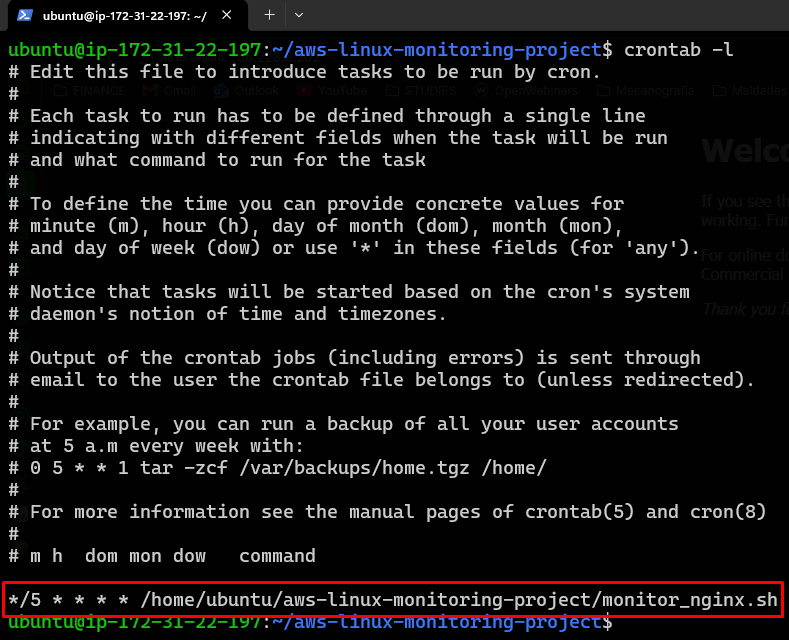

### CloudWatch alarm
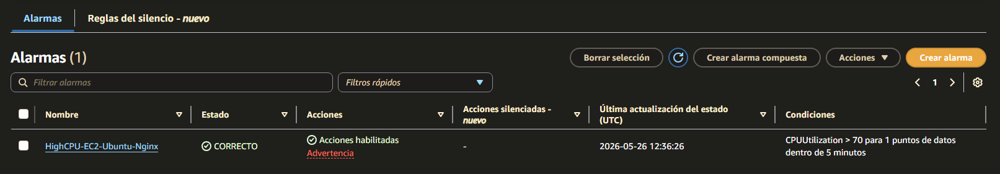
